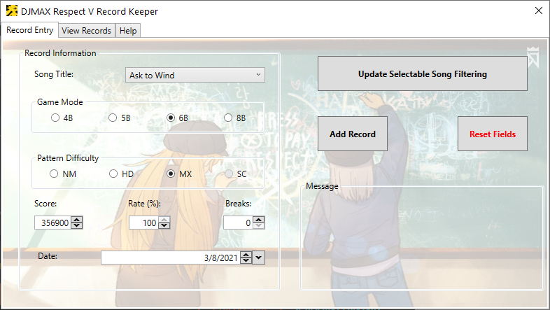

# DJMAX Record Keeper

A C# WPF app that archives past Respect V scores entered by the user and tabulates them.
This can be used for PS4 Respect as well if you don't mind the differing rank thresholds and V-exclusive licenses.

Song and pattern information sourced from [DJMAX Random Selector.](https://github.com/wowvv0w/DJMAX_Random_Selector)
I've fed AllTrackData.csv [into a Python script](https://github.com/hishigami/DJMAX-Record-Keeper/blob/master/bool_tracks.py) that converted the csv's data into JSON, then editted that output to translate Korean titles into their English translations as they appear in Respect, mark (the lack of) charts for each song, and rename the difficulty keys so they don't start with a number and can match the app's naming scheme.

The .NET Core Runtime must be installed to run this app.
